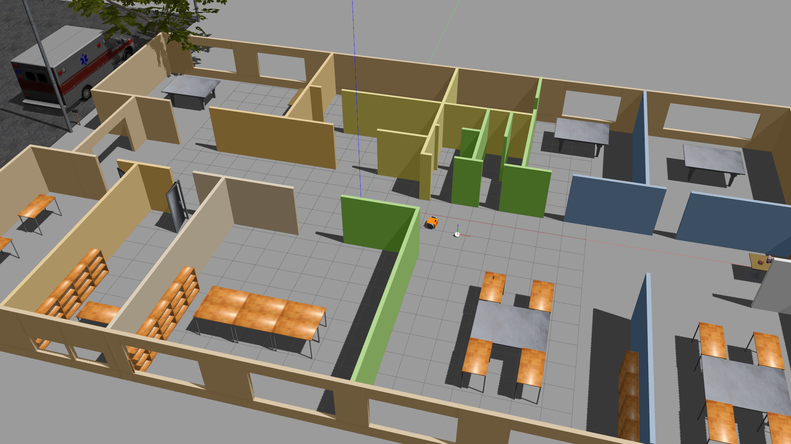

# chase_it_ws

Udacity's SW Engineer Course - Second Project: Go Chase It!
The project is about creating a mobile robot in a gazebo world that follows a white ball. It consist of two packages: `my_robot` (creating the robot and the world), `ball_chaser` (nodes for detecting the white ball and driving the robot).

The structure of the project is shown below:

### Project Structure

    .Project2                          # Go Chase It Project
    ├── my_robot                       # my_robot package
    │   ├── launch                     # launch folder for launch files
    │   │   ├── robot_description.launch
    │   │   ├── world.launch
    │   ├── meshes                     # meshes folder for sensors
    │   │   ├── hokuyo.dae
    │   ├── urdf                       # urdf folder for xarco files
    │   │   ├── my_robot.gazebo
    │   │   ├── my_robot.xacro
    │   ├── world                      # world folder for world files
    │   │   ├── myWorld.world
    │   ├── CMakeLists.txt             # compiler instructions
    │   ├── package.xml                # package info
    ├── ball_chaser                    # ball_chaser package
    │   ├── launch                     # launch folder for launch files
    │   │   ├── ball_chaser.launch
    │   ├── src                        # source folder for C++ scripts
    │   │   ├── drive_bot.cpp
    │   │   ├── process_images.cpp
    │   ├── srv                        # service folder for ROS services
    │   │   ├── DriveToTarget.srv
    │   ├── CMakeLists.txt             # compiler instructions
    │   ├── package.xml                # package info
    └──

### World

The world is consist of mainly the office floor which the plan is taken from [roomsketcher.com](https://www.roomsketcher.com/floor-plan-gallery/325/office-floor-plan-examples/contemporary-office-floor-plan/) (as shown below):

### Robot

The robot consist of differential drive (to drive the two wheels), a lidar (hokuyo lidar), and a camera which are added using Gazebo plugins.

|               3D Model                |               RVis Visualization                |
| :-----------------------------------: | :---------------------------------------------: |
|  |  |

## Getting Started

- Copy this repo to your local drive:
  `git clone https://github.com/Jeyhooon/chase_it_ws.git`
- Change directory to the copied repo: e.g.: `cd ~/git/chase_it_ws`
- `catkin_make`
- `source devel/setup.bash`
- Run `roslaunch my_robot world.launch` (this only lunches the world and the robot)
- Open and source new terminal then run `roslaunch ball_chaser ball_chaser.launch` (this launches the nodes for processing the image and driving the robot)
