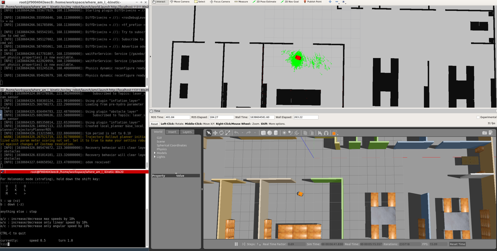
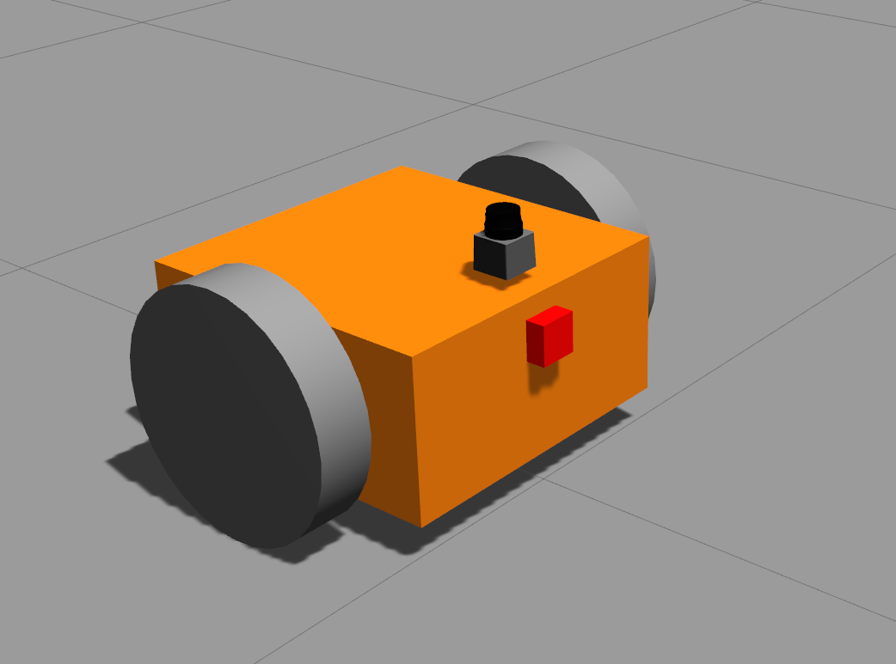
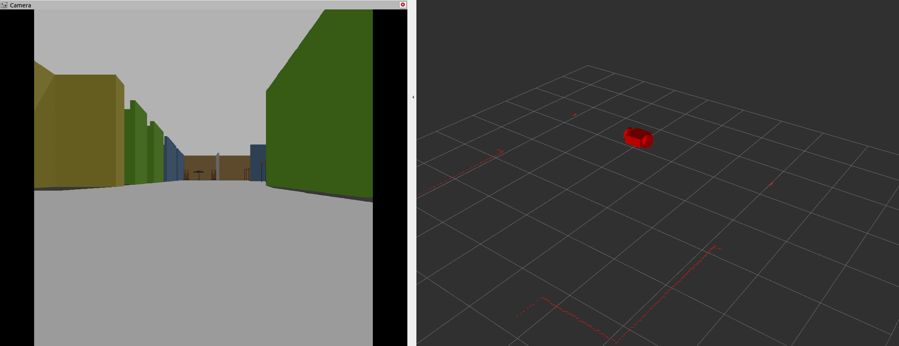

# where_am_i

Udacity's SW Engineer Course - Third Project: Where am I!
The project is about localizing a mobile robot in a gazebo world using [AMCL](http://wiki.ros.org/amcl) package (pre-defined map created from the world file). It consist of three packages: `my_robot` (creating the robot and the world), `pgm_map_creator` (to create a static map from the `.world` file), and `teleop_twist_keyboard` (for controlling the robot using keyboard).

Initial guess for robot location is (0, 0) by moving the robot around it updates its beliefs based on the laser scan and odometry data to localize itself in the environment. As shown in the figure below it's able to find it's position accurately!

To change the parameters of the AMCL package check file in this directory: `src/my_robot/config/`



The structure of the project is shown below:

### Project Structure

    .where_am_i
    |
    ├── my_robot                       # my_robot package
    │   ├── config
    │   │   ├── base_local_planner_params.yaml
    │   │   ├── costmap_common_params.yaml
    │   │   ├── global_costmap_params.yaml
    │   │   ├── local_costmap_params.yaml
    │   │   ├── localization.rviz
    │   ├── launch
    │   │   ├── amcl.launch
    │   │   ├── robot_description.launch
    │   │   ├── world.launch
    │   ├── maps
    │   │   ├── map.pgm
    │   │   ├── map.yaml
    │   ├── meshes
    │   │   ├── hokuyo.dae
    │   ├── urdf
    │   │   ├── my_robot.gazebo
    │   │   ├── my_robot.xacro
    │   ├── world
    │   │   ├── myWorld.world
    │   ├── CMakeLists.txt
    │   ├── package.xml
    |   |
    ├── pgm_map_creator                # pgm_map_creator package
    │   ├── launch
    │   │   ├── request_publisher.launch
    │   ├── maps
    │   │   ├── map.pgm
    │   ├── msgs
    │   │   ├── CMakeLists.txt
    │   │   ├── collision_map_request.proto
    │   ├── src
    │   │   ├── collision_map_creator.cc
    │   │   ├── request_publisher.cc
    │   ├── world
    │   │   ├── my_world.world
    │   ├── CMakeLists.txt
    │   ├── package.xml
    |   |
    ├── teleop_twist_keyboard           # teleop_twist_keyboard package
    │   ├── teleop_twist_keyboard.py
    │   ├── CMakeLists.txt
    │   ├── package.xml
    └──

### World

The world is consist of mainly the office floor which the plan is taken from [roomsketcher.com](https://www.roomsketcher.com/floor-plan-gallery/325/office-floor-plan-examples/contemporary-office-floor-plan/) (as shown below):


### Robot

The robot consist of differential drive (to drive the two wheels), a lidar (hokuyo lidar), and a camera which are added using Gazebo plugins.

|               3D Model                |               RVis Visualization                |
| :-----------------------------------: | :---------------------------------------------: |
|  |  |

## Getting Started

### Pre-requisites

To compile map creator we need to install the following libraries:

```
sudo apt-get install libignition-math2-dev protobuf-compiler
```

- Clone this repo to your local drive:
  `git clone https://github.com/Jeyhooon/where_am_i_-kinetic-.git`
- Change directory to the copied repo: e.g.: `cd ~/git/where_am_i_-kinetic-`
- `catkin_make`
- `source devel/setup.bash`
- Run `roslaunch my_robot world.launch` (this only lunches the world and the robot)
- Open and source new terminal then run `roslaunch my_robot amcl.launch` (this launches the map_server node, amcl node and move_base node (in case want to give a goal position to robot) )
- Open and source new terminal then run `roslaunch teleop_twist_keyboard teleop_twist_keyboard.py` (this would allow you to control the robot using keyboard in case don't want to use the move_base package)
